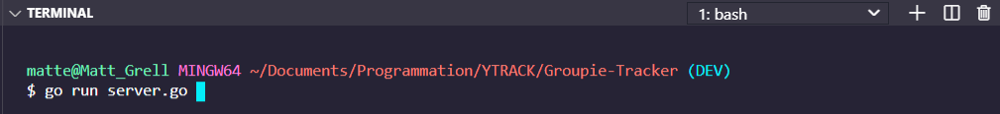
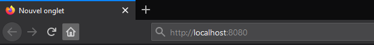

# Groupie-Tracker

## Comment utiliser le projet

1. Telecharger le projet sur ce lien <https://github.com/Matteo-Grellier/Groupie-Tracker/>, l'extraire dans un dossier
2. Aller sur ce lien et cliquer sur <https://cors-anywhere.herokuapp.com/https://groupietrackers.herokuapp.com/api/artists> et cliquer sur ...
3. Ouvrir un terminal dans le dossier du projet
4. Ecrire la commande ``go run server.go`` comme ci-dessous

1. Ecrire cette ligne ``http://localhost:8080`` dans l'url comme ceci 

## Répartition des tâches

Yann : Filtrage des groupes
Luke : CSS du site, barre de recherche
Nicolas : Récupération des données de l'api
Matteo : Structure du projet, git, trello, plusieurs pages sur le site
