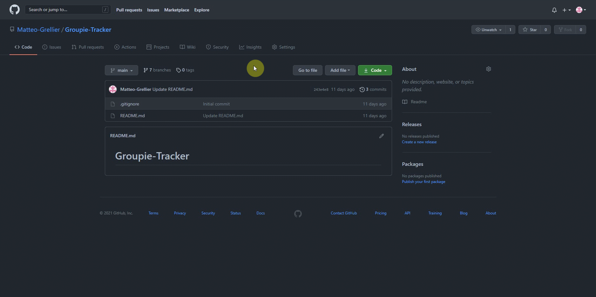
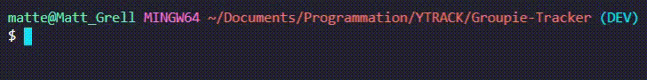
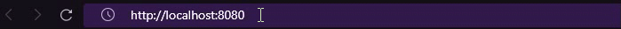
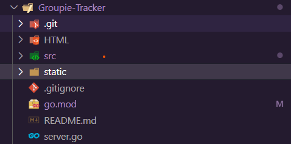

# Groupie-Tracker

## Introdcuction au projet

Ce projet consiste a réaliser un site permettant d'afficher et de rechercher des groupes de musiques disponibles dans un fichier json en ligne. Les grandes lignes de ce projet sont :

- Récuperer le fichier json en ligne avec l'utilisation de GO
- Afficher les groupes dans un tableau
- Filtrer les groupes par nom, date de création
- Utilisation d'une barre de recherche dynamique
- Utilisation d'une carte permettant d'afficher les lieux de concerts des différents groupes
- Utilisation d'un filtre multicritères  

## Comment utiliser le projet

### :warning: NECESSAIRE :warning:

- Installer [go](https://golang.org/dl/go1.16.3.windows-amd64.msi)

### :warning: NECESSAIRE :warning:

1. Telecharger le projet sur ce lien <https://github.com/Matteo-Grellier/Groupie-Tracker/>, l'extraire dans un dossier

2. Ouvrir un terminal dans le dossier du projet
3. Ecrire la commande ``go run server.go`` comme ci-dessous

1. Ecrire cette ligne ``http://localhost:8080`` dans la barre d'addresse comme ci-dessous

## Arborescence du projet

Notre dossier projet ressemble à ceci :

Arborescence fermer :

Nous avons :

- un dossier HTML ou l'on met tout nos templates utilisés
- Un dossier src ou l'on met tout nos fichiers GO
- Un dossier static qui contient :
  - Un dossier css
  - Un dossier JS ou l'ont met tout nos scripts
  - Un dossier images ou l'on met nos images pour le site ou le README.md
- Un fichier .gitignore pour ignorer les fichiers ou dossier inutile à être transferer aux autres membres du groueps
- Un fichier go.mod qui nous permet de faire les imports
- Un fichier README.md
- Un fichier se nommant server.go qui permet de gérer les appels de templates

## Répartition des tâches

Yann : Carte interactive

Luke : CSS navbar, barre de recherche, Filtrage des groupes par nom, dates, Carte interactive

Nicolas : CSS,HTML page accueil + tableau de groupes

Matteo : Structure du projet, git, trello, Paginations, récupération API
